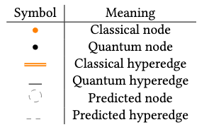

# Hybrid Dependency Hypergraphs

HDHs are 
a special type of directed hypergraphs 
designed to encode temporal and spatial dependencies 
of quantum computations with the purpose of distributing 
originally monolothic quantum or hybrid workloads.
Hypergraph abstractions are currently the standard approach for partitioning quantum computations in distributed quantum computing, [[1](https://arxiv.org/abs/2404.01265)].  
HDHs extend this practice by providing a consistent and complete representation framework, intended to support the systematic evaluation and comparison of partitioning strategies.

A *hypergraph* consists of a set of nodes and a family of subsets of these nodes, called hyperedges[[2](https://www.math.ucdavis.edu/~saito/data/tensor/bretto_hypergraph-theory.pdf)].  
In HDHs these hyperedges can be refered to as connections, as they represent the connectivity requirements between nodes. 
Meaning that if a HDH is partitioned, the operations represented as inter-partition hyperedges would need to be replaced by equivalent communication primitives (such as a non-local gate or a teleportation protocol). 

Hypergraphs are made up of nodes and hyperedges that can either be *quantum* or *classical* (representing qubits or bits/cbits) and *realised* or *potential*.
These types ```q/c``` and ```r/a``` enable the representation of any quantum of hybrid computation.
When [visualized](vis.md) they will be reprented by these symbols:

{ width="300" .center }

Quantum operations may give rise to single-type operations, 
for instance a single qubit gate in the circuit model would give rise a quantum node and hyperedge, 
or two multi-type operations: the initialization of a qubit based on a previous measurement reading would lead to a classical node and a quantum node.
The ```r/a``` types are useful for representing instructions that may "potentially" happen given previous results,
such as [IfElse operations](https://quantum.cloud.ibm.com/docs/en/api/qiskit/qiskit.circuit.IfElseOp) found in dynamic circuits.