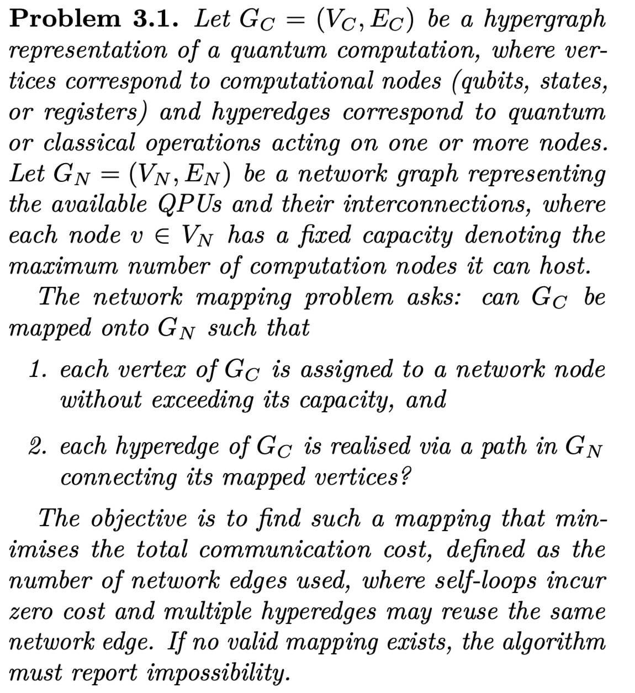
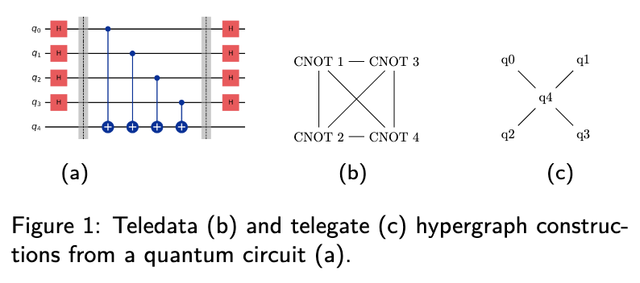

# An introduction to Distributed Quantum Computing

The main problem behind distributed quantum computing is how to map quantum workloads to a network of quantum devices.
Unlike its classical counterpart, the so-called *mapping problem* must account for both classical and quantum data and operations within the workload, as well as quantum and classical devices and connections within the network.

 Two main strategies have arisem in this context:

 * Bespoke algorithm design: splitting the workload into smaller sub-workloads defined by algorithmic tasks (as in distributed versions of [Shor’s](https://arxiv.org/abs/2207.05976) and [Grover’s](https://arxiv.org/abs/2204.10487) algorithms) or by subproblems (something more along the lines of partitioning a large Hamiltonian into sub-Hamiltonians and communication terms [[1](https://arxiv.org/html/2411.02881v1)]).

 * Hypergraph abstractions: abstracting a quantum circuit into a hypergraph to then partition it with max-cut heuristics [[2](https://arxiv.org/abs/1811.10972)], replacing every cut hyperedge with an equivalent communication primitive (a non-local gate when partitioning through a gate, or a teleportation protocol when partitioning through a wire).
 
This library contributes to the second strategy, which unlike bespoke algorithmic designs, 
does not require knowledge of the problem structure or algorithmic logic, and can be applied to any compiled quantum program.

In this context the mapping problem can be defined as:
{ width=400 }

Even in a simplified setting where only communication minimization is considered, the network mapping problem is computationally intractable.
In particular, the decision version of the problem is NP-hard, even for a fixed network topology of only two nodes with equal capacity, where the objective reduces 
to partitioning V_C into two equal-sized sets while minimizing the number of hyperedges crossing between them.
This case is equivalent to the sparsest cut problem with unit capacities, which is NP-hard via a reduction from the max-cut problem [[3](https://dl.acm.org/doi/10.5555/1987042.1987056)].

Our best strategy, therefore, is to design fast and efficient heuristic partitioners.
State-of-the-art partitioning strategies include [Fiduccia–Mattheyses](https://en.wikipedia.org/wiki/Fiduccia–Mattheyses_algorithm) and [multilevel](https://arxiv.org/abs/2503.19082) partitioners (such as [KaHyPar](https://kahypar.org)).
We recommend [this review](https://www.semanticscholar.org/paper/Review-of-Distributed-Quantum-Computing.-From-QPU-Barral-Cardama/639518d8cd950c0ccce4721eb18a470a44f63410) if you want to learn more about how these strategies have been applied to circuit partitioning.
Nonetheless, a few bottlenecks remain, making cross-partitioning method comparison difficult.

For a start, hypergraphs built for abstracting quantum workloads can be constructed using different conventions, for example, mapping qubits to nodes and multi-qubit gates to hyperedges, or vice versa.
These are known as telegate and teledata.
{ width=400 }

This variety of representations has led to inconsistencies that complicate direct comparisons between partitioning methods for distributed quantum circuits.
To address this, strategies that can utilize both abstractions have been proposed [[4](https://arxiv.org/abs/2505.01184),[5](https://arxiv.org/abs/2408.01424)], but not an easy-to-use unifying abstraction.

Beyond telegate and teledata, restricting to the circuit model also imposes a significant limitation.
Photons, the most practical medium for long-range quantum communication—are used in photonic quantum computers that do not operate under the circuit model.
As a result, current compiler distribution frameworks are incompatible with key hardware platforms needed for near-term distributed quantum computing testbeds.
They exclude alternative computational models required by some quantum devices and cannot accommodate hybrid quantum–classical workloads.

***HDHs** address both challenges and provide a unifying abstraction for representing partitioning across all models.
This library is designed to make HDHs easy to construct and to offer a [database](database.md) where state-of-the-art and future techniques can be benchmarked against each other in one common framework.
For a concise overview of how HDHs are built, see our [brief introduction to HDHs](hdh.md).*