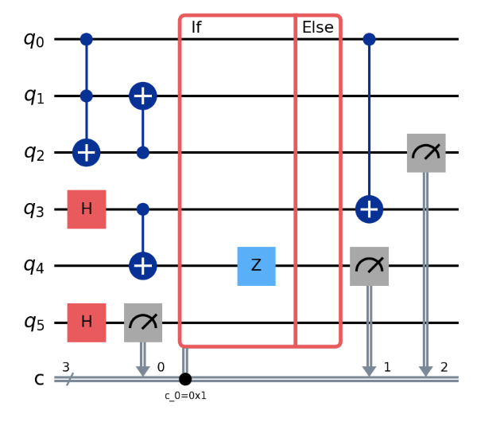

# Computational models

Quantum computation can be performed with various computational models that have different instruction sets, such as quantum circuits (which perform computation through gates) or measurement based patterns (which perform computation through corrections).
The diversity between these models can be attributed to hardware constraints as well as to the age of the field.
Although they are all equivalent and computations can theoretically be translated accross them, this process is inneficient and hard to due to a lack of clear set of cross-model translators.  

HDHs were designed to abstract all the models into a unified framework.
As such, they are model agnostic and can be constructed from any set of instructions.
Specific model classes can be found under the ```hdh/models``` folder.
To facilitate the usage of HDHs, the library has a set of embedded model mappings which translate instruction sets from popular quantum computational models into reusable HDH motifs.
You can find details and examples of how to use these model classes and SDK converters bellow.

### Circuits
The circuit model is among the most widely adopted paradigms of quantum computation, particularly in implementations on industrial quantum hardware (with the notable exception of photonic qubits).
Quantum circuits are a universal model of computation.

They form the foundation of many leading quantum software packages, including 
[Qiskit](https://www.ibm.com/quantum/qiskit), 
[OpenQASM](https://openqasm.com), 
[Cirq](https://quantumai.google/cirq), 
[Amazon Braket SDK](https://docs.aws.amazon.com/braket/), 
and [PennyLane](https://pennylane.ai);
which you can directly map to the librarys' ```Circuit``` class and then to HDHs (see examples of how to use these converters bellow).

A quantum circuit is composed of a sequence of quantum gates applied to a set of qubits (commonly represented as horizontal wires). Gates, visualized as boxes placed on these wires, may act on one or multiple qubits.
Single-qubit gates correspond to rotations of the qubit’s state vector on the Bloch sphere.
For example, a Z-rotation by angle 
π rotates the state vector by 
π radians about the z-axis.

Multi-qubit gates, such as controlled-X (CX), act conditionally on one qubit’s state and thereby create dependencies among qubits. For instance, a CX gate applies an X gate to the target qubit only if the control qubit is in the 
∣1⟩ state.
Such gates generate entanglement, as discussed in the [introduction to DQC](intro.md).

Beyond static gates, circuits also support classically conditioned operations.
For example, an IfElse construct applies one subcircuit if a specified classical register holds a given value and another subcircuit otherwise. This enables hybrid quantum–classical flow control within circuits.

Finally, measurement operations project qubits into classical bits, irreversibly collapsing their quantum state.

The goal of HDHs is to make explicit the transformations induced by all gates and measurements, enabling large circuits to be partitioned into smaller, distributable subcircuits.
Mapping a quantum circuit into an HDH involves applying the correspondences summarized in the table below:

{ width=300 }

Bellow is an example of how to build a circuit using the library’s ```Circuit``` class and map it to an HDH:
```python
import hdh
from hdh.models.circuit import Circuit

circuit = Circuit()

# Set of instructions
circuit.add_instruction("ccx", [0, 1, 2])
circuit.add_instruction("h", [3])
circuit.add_instruction("h", [5])
circuit.add_instruction("cx", [3, 4])
circuit.add_instruction("cx", [2, 1])
circuit.add_conditional_gate(5, 4, "z")
circuit.add_instruction("cx", [0, 3])
circuit.add_instruction("measure", [2])
circuit.add_instruction("measure", [4])

hdh = circuit.build_hdh() # Generate HDH
fig = plot_hdh(hdh) # Visualize HDH
```

This code is equivalent to the following circuit:
{ width=300 }

Which is mapped to HDH:
{ width=500 }

The HDH is composed of the motifs shown in the mapping table, appearing in the temporal order of computation and indexed by the qubits they abstract.
Note that a qubit is not initialized until the timestep immediately preceding its first operation.

### MBQC patterns

### Quantum walks

### Quantum cellular automata

# Built in Converters

# Make your own instruction set