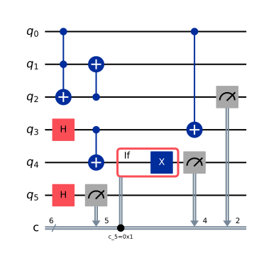
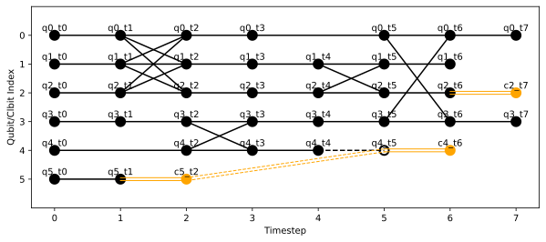
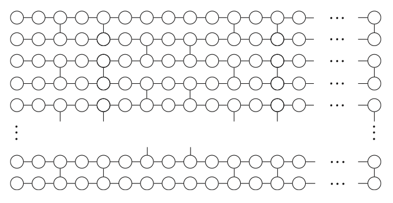
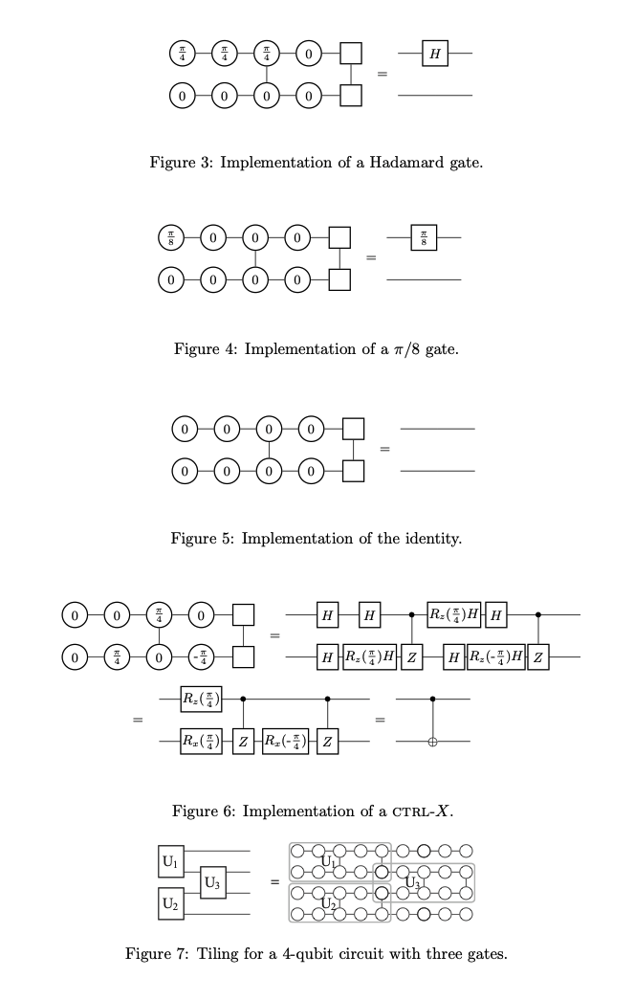
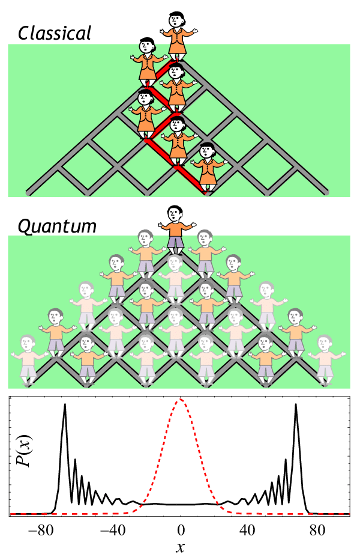
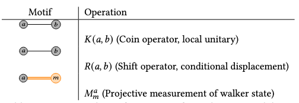
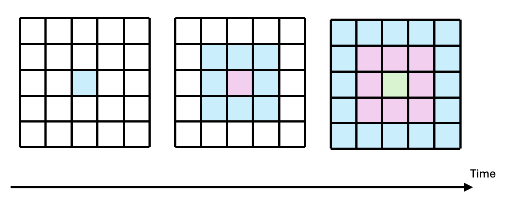
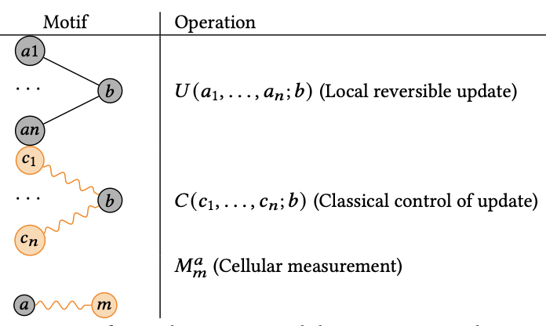

# Computational models

Quantum computation can be performed with various computational models that have different instruction sets, such as quantum circuits (which perform computation through gates) or measurement based patterns (which perform computation through corrections).
The diversity between these models can be attributed to hardware constraints as well as to the age of the field.
Although they are all equivalent and computations can theoretically be translated accross them, this process is inneficient and hard to due to a lack of clear set of cross-model translators.  

HDHs were designed to abstract all the models into a unified framework.
As such, they are model agnostic and can be constructed from any set of instructions.
Specific model classes can be found under the ```hdh/models``` folder.
To facilitate the usage of HDHs, the library has a set of embedded model mappings which translate instruction sets from popular quantum computational models into reusable HDH motifs.
You can find details and examples of how to use these model classes and SDK converters bellow.

### Circuits
The circuit model is among the most widely adopted paradigms of quantum computation, particularly in implementations on industrial quantum hardware (with the notable exception of photonic qubits).
Quantum circuits are a universal model of computation.

They form the foundation of many leading quantum software packages, including 
[Qiskit](https://www.ibm.com/quantum/qiskit), 
[OpenQASM](https://openqasm.com), 
[Cirq](https://quantumai.google/cirq), 
[Amazon Braket SDK](https://docs.aws.amazon.com/braket/), 
and [PennyLane](https://pennylane.ai);
which you can directly map to the librarys' ```Circuit``` class and then to HDHs (see examples of how to use these converters bellow).

A quantum circuit is composed of a sequence of quantum gates applied to a set of qubits (commonly represented as horizontal wires). Gates, visualized as boxes placed on these wires, may act on one or multiple qubits.
Single-qubit gates correspond to rotations of the qubit’s state vector on the Bloch sphere.
For example, a Z-rotation by angle 
π rotates the state vector by 
π radians about the z-axis.

Multi-qubit gates, such as controlled-X (CX), act conditionally on one qubit’s state and thereby create dependencies among qubits. For instance, a CX gate applies an X gate to the target qubit only if the control qubit is in the 
∣1⟩ state.
Such gates generate entanglement, as discussed in the [introduction to DQC](intro.md).

Beyond static gates, circuits also support classically conditioned operations.
For example, an IfElse construct applies one subcircuit if a specified classical register holds a given value and another subcircuit otherwise. This enables hybrid quantum–classical flow control within circuits.

Finally, measurement operations project qubits into classical bits, irreversibly collapsing their quantum state.

The goal of HDHs is to make explicit the transformations induced by all gates and measurements, enabling large circuits to be partitioned into smaller, distributable subcircuits.
Mapping a quantum circuit into an HDH involves applying the correspondences summarized in the table below:

{ width=300 }

Bellow is an example of how to build a circuit using the library’s ```Circuit``` class and map it to an HDH:
```python
import hdh
from hdh.models.circuit import Circuit
from hdh.visualize import plot_hdh

circuit = Circuit()

# Set of instructions
circuit.add_instruction("ccx", [0, 1, 2])
circuit.add_instruction("h", [3])
circuit.add_instruction("h", [5])
circuit.add_instruction("cx", [3, 4])
circuit.add_instruction("cx", [2, 1])
circuit.add_instruction("measure", [5])

circuit.add_conditional_gate(5, 4, "x") 

circuit.add_instruction("cx", [0, 3])
circuit.add_instruction("measure", [2])
circuit.add_instruction("measure", [4])

hdh = circuit.build_hdh() # Generate HDH
fig = plot_hdh(hdh) # Visualize HDH
```

This code is equivalent to the following circuit:
{ width=300 }

Which is mapped to HDH:
{ width=500 }

The HDH is composed of the motifs shown in the mapping table, appearing in the temporal order of computation and indexed by the qubits they abstract.
Note that a qubit is not initialized until the timestep immediately preceding its first operation.

### MBQC patterns

Measurement based quantum computing is one of the alternative universal models to quantum circuits [[3](https://arxiv.org/abs/quant-ph/0108118)].
It can be implemented on photonic quantum computers, as is often paired alongside fusion gates [[4](https://arxiv.org/abs/2101.09310)].
MBQC patterns consist of 4 types of operations [[5](https://arxiv.org/abs/0704.1263)]:

* N: Auxiliary state preparations 

* E: Entaglement operations

* M: Measurements

* C: Corrections

Intuitively, MBQC patterns can be thought of as large cluster states built from entangled nodes.
The computation proceeds by measuring these nodes in sequence, where later measurement bases are adapted according to the outcomes of earlier ones.
Measurement based patterns may look like this (taken from [6](https://arxiv.org/pdf/0807.4154)):
{ width=300 }. Here the N operations form the nodes, and E operations make the Edges. 
Time flows from left to right; and the angles (0, π/8) correspond to correction angles.
Equivalences between circuit gates and MBQC patterns can be drawn (in this case squares = output qubits) [[6](https://arxiv.org/pdf/0807.4154)]:

{ width=600 }

But they are not necessarily the most efficient use of the model.
Many MBQC native algorithms have been proposed [[7](https://arxiv.org/abs/2310.13524),[8](https://arxiv.org/abs/2305.10742)], and the model is very compatible with various error correction techniques.
If you'd like a more in depth tutorial on the model we recommend this [pennylane tutorial on MBQC](https://pennylane.ai/qml/demos/tutorial_mbqc). 

Distribution of MBQC patterns can be confused with the partitioning of the substrate cluster state over which they are computed (the network you see).
This is a valid method for partitioning the computation, but it is not the one that HDHs offer.
As in the circuit model, HDHs abstract the operations performed during the computation (atop the cluster or during cluster generation) in a way that reflects not only their entanglement dependencies but also their temporal dependencies (aka the order in which they are performed).
Mapping MBQC patterns to HDHs is relatively simple:

```python
import hdh
from hdh.models.mbqc import MBQC
from hdh.visualize import plot_hdh

mbqc = MBQC()

# Set of instructions
mbqc.add_operation("N", [], "q0")
mbqc.add_operation("N", [], "q1")
mbqc.add_operation("E", ["q0", "q1"], "q1")
mbqc.add_operation("M", ["q0"], "c0")
mbqc.add_operation("C", ["c0"], "q2")

hdh = mbqc.build_hdh() # Generate HDH
fig = plot_hdh(hdh) # Visualize HDH

```

This code generates HDH:
{ width=600 }

Unlike in the circuit model, MBQC pattern operations are not "automatically" assigned to the ```q_``` and ```c_``` naming conventions.
This is because a node in an MBQC pattern doesn't necessarily directly correspond to a qubit. 
For simplicity we have made it so in the example above, but feel free to name them something else.
Note that if you do the visualize function may play some tricks on you depending on the version of the library you are working with.

This is the corresponding motif to operation mapping table for the MBQC model:
{ width=500 }


### Quantum walks 
Quantum walks are another universal model of quantum computation [[9](https://arxiv.org/abs/0806.1972)].
Like quantum circuits, quantum walks can be expressed using different sets of unitary operations and are universal for quantum computation. 
However, unlike circuits, quantum walks are not inherently defined in terms of gate sequences, they are abstract evolution models that can be implemented via gates or analog dynamics depending on the platform.

They come in various forms, typically categorized as discrete-time or continuous-time variants [[10](https://arxiv.org/abs/2404.04178)].
In discrete-time walks (DTQW), evolution proceeds in steps using a coin operator and a shift operator; while continuous-time walks (CTQW) evolve directly under a Hamiltonian.

In both cases, the key idea is that the walker’s amplitude spreads across positions in superposition, creating interference patterns that can be harnessed for computation.
This interference, guided by the chosen coin or Hamiltonian, allows quantum walks to implement algorithms and decision processes that outperform their classical counterparts.
Unlike classical random walks, where probabilities govern independent step outcomes, quantum walks evolve coherently under unitary dynamics, so amplitudes rather than probabilities interfere.
Perhaps a useful visualisation of this is to view quantum walks as waves spreading across all paths simultaneously, 
as per the image bellow (taken from [[11](https://arxiv.org/abs/0811.1795)]), 
where the two peaks of the amplitude distribution at the final row can be seen at the edges, in contrast to the central Gaussian-like spread (red) of the classical walk:

{ width=300 }

The reason why the distributions are different is that in a classical walk, each step is an independent random choice. Adding them up gives a binomial distribution, which converges to a Gaussian around the center.
In a quantum walk, the walker is in a superposition of paths. At each step, amplitudes for moving left or right interfere.
Constructive interference pushes weight toward the outer edges, while destructive interference cancels amplitudes near the center.
As a result, the probability distribution spreads ballistically (linearly with the number of steps) rather than diffusively (square root of steps), and peaks form at the farthest positions the walker can reach.

You can map QW to HDHs as per: 

```python
import hdh
from hdh.models.qw import QW
from hdh.visualize import plot_hdh

qw = QW()

# Set of instructions
q0 = "q0"  
q1 = qw.add_coin(q0)         
q2 = qw.add_shift(q1)        
qw.add_measurement(q2, "c0")

hdh = qw.build_hdh() # Generate HDH
fig = plot_hdh(hdh) # Visualize HDH
```
This code generates HDH:
{ width=600 }

This is the corresponding motif to operation mapping table for the QW model:
{ width=500 }

Bellow you can find a short explanation explaining the differences between DTQW and CTQW implementations.
If you're interested in QW, we recommend [this book](http://ndl.ethernet.edu.et/bitstream/123456789/73178/1/277.pdf).

#### Discrete Time Quantum Walks

A DTQW is made up of a set of timed operations imposed by its coin and walker.
If we where to equate this to the NEMC format for MBQC, DTQW operations would be of two types:

* Coin: local unitaries acting on internal degrees of freedom at each position, e.g., internal "spin" or coin states,
* Shift: conditional displacements of walker states in position space based on the coin state.


The outputs of each coin toss serve as inputs to the subsequent shift.
A DTQW is "valid" if all operations can be sequentially ordered.

Their mapping to HDHs is straightforward:
inputs and outputs align naturally with state nodes, while coin and shift operations correspond to channel hyperedges.
In practice, each coin operation introduces a local unitary hyperedge attached to the state node representing the walker’s internal degree of freedom at a given time.
Each shift operation then acts as a conditional hyperedge spanning the relevant position nodes, effectively redirecting walker states according to the coin outcome.
Because HDHs are time-respecting, the sequential interplay of coin and shift steps is preserved explicitly, making the walk’s evolution appear as an alternating pattern of local and conditional hyperedges across timesteps.

#### Continuous Time Quantum Walks

In contrast, CTQWs describe physical evolution over time under a Hamiltonian and do not, by themselves, constitute a universal computational model.
They lack a well-defined, manipulable set of time-indexed operations.
Nonetheless, CTQWs can still be mapped to HDH constructions by interpreting their continuous evolution as a resource-driven process.
HDHs, as an abstraction, can accommodate this by using dedicated predictive constructs to represent these operations.
Nonetheless the library expect discrete time walks.
In other words ir is possible to discretize the CTQW, and map it using the DTQW mapping, whilst setting each operation to the predicted type. But this library does not do this for now.
This logic can be extended to other prominent quantum frameworks, such as adiabatic quantum computing, which likewise lack native representations of sequential logical operations but can still be encoded into HDHs by discretizing their dynamics and treating them as structured evolution patterns.

### Quantum cellular automata

Finally, the last model currently compatible with the HDH library is QCA (Quantum cellular automaton).
QCAs originally arose as an
alternative paradigm for quantum computation, though more recently they have found
application in understanding topological phases of matter and have been proposed as
models of periodically driven (Floquet) quantum systems [[12](https://quantum-journal.org/papers/q-2020-11-30-368/pdf/)].
A QCA consists of a lattice of cells, each holding a finite-dimensional quantum state, whose evolution is defined by repeated application of local, translation-invariant rules.
They are basically the equivalent of Cellular Automatons, which are beautifully described in [Wolfram MathWorld](https://mathworld.wolfram.com/CellularAutomaton.html) as:
a collection of "colored" cells on a grid of specified shape that evolves through a number of discrete time steps according to a set of rules based on the states of neighboring cells.
In QCAs evolution ensure that information propagates only within a bounded neighborhood per time step, enforcing causality and making QCAs suitable for modeling distributed quantum dynamics.
Similarly to quantum walks, their dynamics can be reduced to two core operations:

* Unitary updates: local reversible transformations that map a neighborhood $A$ to output cells $B$, preserving causality and unitarity,
* Swap or shift layers: structural steps to rearrange or relabel cell contents for staggered updates.

You can think of QCA operation evolution as a slow conquer of a substrate lattice:{ width=300 }

They can be mapped to HDHs through: 
```python
import hdh
from hdh.models.qca import QCA
from hdh.visualize import plot_hdh

# Topology of lattice over which QCA will evolve
topology = {
    "q0": ["q1", "q2"],
    "q1": ["q0"],
    "q2": ["q0"]
}

measurements = {"q1", "q2"}

qca = QCA(topology=topology, measurements=measurements, steps=3)
hdh = qca.build_hdh() # Generate HDH
fig = plot_hdh(hdh) # Visualize HDH
```
This code generates HDH:
{ width=600 }

This is the corresponding motif to operation mapping table for the QCA model:
{ width=250 }

# Built in Converters
The library currently has converters from 

* [Qiskit](https://www.ibm.com/quantum/qiskit), 
* [OpenQASM](https://openqasm.com), 
* [Cirq](https://quantumai.google/cirq), 
* [Amazon Braket SDK](https://docs.aws.amazon.com/braket/), 
* and [PennyLane](https://pennylane.ai).

These converters take in computations written in these languages/SDKs and transform them into relevant HDHs.
They can be used as follows:

```python 
import hdh
import qiskit
from qiskit import QuantumCircuit
from hdh.converters import from_qiskit
from hdh.visualize import plot_hdh
from hdh.passes.cut import compute_cut, cost, partition_sizes, compute_parallelism_by_time

# Qiskit circuit
qc = QuantumCircuit(3)
qc.h(0)
qc.cx(0, 1)
qc.ccx(1, 2, 0)
qc.measure_all()

hdh_graph = from_qiskit(qc) # Generate HDH
fig = plot_hdh(hdh) # Visualize HDH
```

### Reconverting partitioned HDHs back to Qiskit

After partitioning an HDH you can recover one Qiskit ``QuantumCircuit`` per QPU using ``partitions_to_qiskit``.
Each sub-circuit contains only the gates whose qubits are entirely local to that partition; cross-partition gates are excluded (they become teledata/telegate communication primitives in a full DQC implementation).

```python
from qiskit import QuantumCircuit
from hdh.converters.qiskit_converter import from_qiskit, partitions_to_qiskit
from hdh.passes.cut import compute_cut

# 1. Build and convert a Qiskit circuit
qc = QuantumCircuit(4)
qc.h(0)
qc.cx(0, 1)
qc.cx(1, 2)
qc.cx(2, 3)

hdh = from_qiskit(qc)

# 2. Partition into k=2 QPUs with a capacity of 2 qubits each
partitions, cut_cost = compute_cut(hdh, k=2, cap=2)
print(f"Cut cost: {cut_cost} cross-partition edges")

# 3. Recover one Qiskit sub-circuit per partition
sub_circuits = partitions_to_qiskit(hdh, partitions)

for i, sub_qc in enumerate(sub_circuits):
    print(f"\n--- Partition {i} ---")
    print(f"  Qubits (circuit size): {sub_qc.num_qubits}")
    print(f"  Gates: {len(sub_qc.data)}")
    print(sub_qc.draw())
```

If you only need to convert a single HDH back to Qiskit without partitioning, use ``hdh_to_qiskit`` directly:

```python
from hdh.converters.qiskit_converter import from_qiskit, hdh_to_qiskit

qc = QuantumCircuit(2)
qc.h(0)
qc.cx(0, 1)

hdh = from_qiskit(qc)
qc_reconstructed = hdh_to_qiskit(hdh)
print(qc_reconstructed.draw())
```

Note that gate parameters (angles for ``rx``, ``ry``, ``rz`` etc.) are not preserved through the HDH representation and will default to 0 on reconstruction.

# Make your own instruction set

Beyond the given models and converters, you can also make your own model class by defining the desired HDH motif construction.
A good rule of thumb is to consider inputs and outputs of operations as nodes and the operations themselves as hyperedges.
This is how the ```Circuit``` class looks like:

```python
from typing import List, Tuple, Optional, Set, Dict, Literal
import sys
import os
sys.path.insert(0, os.path.abspath(os.path.join(os.path.dirname(__file__), '..')))
from hdh.hdh import HDH

class Circuit:
    def __init__(self):
        self.instructions: List[
            Tuple[str, List[int], List[int], List[bool], Literal["a", "p"]]
        ] = []  # (name, qubits, bits, modifies_flags, cond_flag)

    def add_instruction(
        self,
        name: str,
        qubits: List[int],
        bits: Optional[List[int]] = None,
        modifies_flags: Optional[List[bool]] = None,
        cond_flag: Literal["a", "p"] = "a"
    ):
        name = name.lower()

        if name == "measure":
            modifies_flags = [True] * len(qubits)
        else:
            bits = bits or []
            modifies_flags = modifies_flags or [True] * len(qubits)

        self.instructions.append((name, qubits, bits, modifies_flags, cond_flag))

    def build_hdh(self, hdh_cls=HDH) -> HDH:
        hdh = hdh_cls()
        qubit_time: Dict[int, int] = {}
        bit_time: Dict[int, int] = {}
        last_gate_input_time: Dict[int, int] = {}

        for name, qargs, cargs, modifies_flags, cond_flag in self.instructions:
            # --- Canonicalize inputs ---
            qargs = list(qargs or [])
            if name == "measure":
                cargs = list(cargs) if cargs is not None else qargs.copy()  # 1:1 map
                if len(cargs) != len(qargs):
                    raise ValueError("measure: len(bits) must equal len(qubits)")
                modifies_flags = [True] * len(qargs)
            else:
                cargs = list(cargs or [])
                if modifies_flags is None:
                    modifies_flags = [True] * len(qargs)
                elif len(modifies_flags) != len(qargs):
                    raise ValueError("len(modifies_flags) must equal len(qubits)")
            
            #print(f"\n=== Adding instruction: {name} on qubits {qargs} ===")
            # for q in qargs:
                #print(f"  [before] qubit_time[{q}] = {qubit_time.get(q)}")
                
            # Measurements
            if name == "measure":
                for i, qubit in enumerate(qargs):
                    # Use current qubit time (default 0), do NOT advance it here
                    t_in = qubit_time.get(qubit, 0)
                    q_in = f"q{qubit}_t{t_in}"
                    hdh.add_node(q_in, "q", t_in, node_real=cond_flag)

                    bit = cargs[i]
                    t_out = t_in + 1              # classical result at next tick
                    c_out = f"c{bit}_t{t_out}"
                    hdh.add_node(c_out, "c", t_out, node_real=cond_flag)

                    hdh.add_hyperedge({q_in, c_out}, "c", name="measure", node_real=cond_flag)

                    # Next-free convention for this bit stream
                    bit_time[bit] = t_out + 1

                    # Important: do NOT set qubit_time[qubit] = t_in + k
                    # The quantum wire collapses; keep its last quantum tick unchanged.
                continue
            
            # Conditional gate handling
            if name != "measure" and cond_flag == "p" and cargs:
                # Supports 1 classical control; extend to many if you like
                ctrl = cargs[0]

                # Ensure times exist
                for q in qargs:
                    if q not in qubit_time:
                        qubit_time[q] = max(qubit_time.values(), default=0)
                        last_gate_input_time[q] = qubit_time[q]

                # Classical node must already exist (e.g., produced by a prior measure)
                # bit_time points to "next free" slot; the latest existing node is at t = bit_time-1
                c_latest = bit_time.get(ctrl, 1) - 1
                cnode = f"c{ctrl}_t{c_latest}"
                hdh.add_node(cnode, "c", c_latest, node_real=cond_flag)

                edges = []
                for tq in qargs:
                    # gate happens at next tick after both inputs are ready
                    t_in_q = qubit_time[tq]
                    t_gate = max(t_in_q, c_latest) + 1
                    qname = f"q{tq}"
                    qout = f"{qname}_t{t_gate}"

                    # ensure the quantum output node exists at gate time
                    hdh.add_node(qout, "q", t_gate, node_real=cond_flag)

                    # add classical hyperedge feeding the quantum node
                    e = hdh.add_hyperedge({cnode, qout}, "c", name=name, node_real=cond_flag)
                    edges.append(e)

                    # advance quantum time
                    last_gate_input_time[tq] = t_in_q
                    qubit_time[tq] = t_gate

                # store edge_args for reconstruction/debug
                q_with_time = [(q, qubit_time[q]) for q in qargs]
                c_with_time = [(ctrl, c_latest + 1)]  # next-free convention; adjust if you track exact
                for e in edges:
                    hdh.edge_args[e] = (q_with_time, c_with_time, modifies_flags or [True] * len(qargs))

                continue

            #Actualized gate (non-conditional)
            for q in qargs:
                if q not in qubit_time:
                    qubit_time[q] = max(qubit_time.values(), default=0)
                    last_gate_input_time[q] = qubit_time[q]  # initial input time

            active_times = [qubit_time[q] for q in qargs]
            time_step = max(active_times) + 1 if active_times else 0

            in_nodes: List[str] = []
            out_nodes: List[str] = []

            intermediate_nodes: List[str] = []
            final_nodes: List[str] = []
            post_nodes: List[str] = []
            
            #DEBUG
            #print("  [after]", {q: qubit_time[q] for q in qargs})
            #print("  [after]", {q: qubit_time[q] for q in qargs})

            multi_gate = (name != "measure" and len(qargs) > 1)
            common_start = max((qubit_time.get(q, 0) for q in qargs), default=0) if multi_gate else None

            for i, qubit in enumerate(qargs):
                t_in = qubit_time[qubit]
                qname = f"q{qubit}"
                in_id = f"{qname}_t{t_in}"
                hdh.add_node(in_id, "q", t_in, node_real=cond_flag)
                #print(f"    [+] Node added: {in_id} (type q, time {t_in})")
                #print(f"    [+] Node added: {in_id} (type q, time {t_in})")
                in_nodes.append(in_id)
                #print(f"    [qubit {qubit}] modifies_flag = {modifies_flags[i]}")
                #print(f"    [qubit {qubit}] modifies_flag = {modifies_flags[i]}")

                # choose timeline
                if multi_gate:
                    t1 = common_start + 1
                    t2 = common_start + 2
                    t3 = common_start + 3
                else:
                    t1 = t_in + 1
                    t2 = t1 + 1
                    t3 = t2 + 1

                # create mid/final/post nodes for BOTH cases
                mid_id   = f"{qname}_t{t1}"
                final_id = f"{qname}_t{t2}"
                post_id  = f"{qname}_t{t3}"

                hdh.add_node(mid_id,   "q", t1, node_real=cond_flag)
                hdh.add_node(final_id, "q", t2, node_real=cond_flag)
                hdh.add_node(post_id,  "q", t3, node_real=cond_flag)

                intermediate_nodes.append(mid_id)
                final_nodes.append(final_id)
                post_nodes.append(post_id)

                last_gate_input_time[qubit] = t_in
                qubit_time[qubit] = t3

            edges = []
            if len(qargs) > 1:
                # Stage 1: input → intermediate (1:1)
                for in_node, mid_node in zip(in_nodes, intermediate_nodes):
                    e = hdh.add_hyperedge({in_node, mid_node}, "q", name=f"{name}_stage1", node_real=cond_flag)
                    #print(f"    [~] stage1 {in_node} → {mid_node}")
                    #print(f"    [~] stage1 {in_node} → {mid_node}")
                    edges.append(e)

                # Stage 2: full multiqubit edge from intermediate → final
                e2 = hdh.add_hyperedge(set(intermediate_nodes) | set(final_nodes), "q", name=f"{name}_stage2", node_real=cond_flag)
                #print(f"    [~] stage2 |intermediate|={len(intermediate_nodes)} → |final|={len(final_nodes)}")
                #print(f"    [~] stage2 |intermediate|={len(intermediate_nodes)} → |final|={len(final_nodes)}")
                edges.append(e2)

                # Stage 3: final → post (1:1)
                for f_node, p_node in zip(final_nodes, post_nodes):
                    e = hdh.add_hyperedge({f_node, p_node}, "q", name=f"{name}_stage3", node_real=cond_flag)
                    #print(f"    [~] stage3 {f_node} → {p_node}")
                    #print(f"    [~] stage3 {f_node} → {p_node}")
                    edges.append(e)

            if name == "measure":
                for i, qubit in enumerate(qargs):
                    t_in = qubit_time.get(qubit, 0)
                    q_in = f"q{qubit}_t{t_in}"
                    hdh.add_node(q_in, "q", t_in, node_real=cond_flag)

                    bit = cargs[i]
                    t_out = t_in + 1
                    c_out = f"c{bit}_t{t_out}"
                    hdh.add_node(c_out, "c", t_out, node_real=cond_flag)

                    hdh.add_hyperedge({q_in, c_out}, "c", name="measure", node_real=cond_flag)
                    bit_time[bit] = t_out + 1
                continue

            if name != "measure":
                for bit in cargs:
                    t = bit_time.get(bit, 0)
                    cname = f"c{bit}"
                    out_id = f"{cname}_t{t + 1}"
                    hdh.add_node(out_id, "c", t + 1, node_real=cond_flag)
                    out_nodes.append(out_id)
                    bit_time[bit] = t + 1

            all_nodes = set(in_nodes) | set(out_nodes)
            if all(n.startswith("c") for n in all_nodes):
                edge_type = "c"
            elif any(n.startswith("c") for n in all_nodes):
                edge_type = "c"
            else:
                edge_type = "q"

            edges = []

            if len(qargs) > 1:
                # Multi-qubit gate 
                # Stage 1: input → intermediate (1:1)
                for in_node, mid_node in zip(in_nodes, intermediate_nodes):
                    edge = hdh.add_hyperedge({in_node, mid_node}, "q", name=f"{name}_stage1", node_real=cond_flag)
                    # DEBUG
                    #print(f"    [~] Hyperedge added over: {in_node} → {mid_node}, label: {name}_stage1")
                    #print(f"    [~] Hyperedge added over: {in_node} → {mid_node}, label: {name}_stage1")
                    edges.append(edge)

                # Stage 2: full multiqubit edge from intermediate → final
                edge2 = hdh.add_hyperedge(set(intermediate_nodes) | set(final_nodes), "q", name=f"{name}_stage2", node_real=cond_flag)
                # DEBUG
                #print(f"    [~] Hyperedge added over: {in_node} → {mid_node}, label: {name}_stage2")
                #print(f"    [~] Hyperedge added over: {in_node} → {mid_node}, label: {name}_stage2")
                edges.append(edge2)

                # Stage 3: final → post (1:1 again)
                for final_node, post_node in zip(final_nodes, post_nodes):
                    edge = hdh.add_hyperedge({final_node, post_node}, "q", name=f"{name}_stage3", node_real=cond_flag)
                    # DEBUG
                    #print(f"    [~] Hyperedge added over: {in_node} → {mid_node}, label: {name}_stage1")
                    #print(f"    [~] Hyperedge added over: {in_node} → {mid_node}, label: {name}_stage1")
                    edges.append(edge)
                                                    
            else:
                # Single-qubit gate
                for i, qubit in enumerate(qargs):
                    
                    if modifies_flags[i] and name != "measure":
                        t_in = last_gate_input_time[qubit] 
                        t_out = t_in + 1
                        qname = f"q{qubit}"
                        in_id = f"{qname}_t{t_in}"
                        out_id = f"{qname}_t{t_out}"
                        # DEBUG
                        #print(f"[{name}] Q{qubit} t_in = {t_in}, expected from qubit_time = {qubit_time[qubit]}")
                        #print(f"[{name}] Q{qubit} t_in = {t_in}, expected from qubit_time = {qubit_time[qubit]}")
                        hdh.add_node(out_id, "q", t_out, node_real=cond_flag)
                        # DEBUG
                        #print(f"    [+] Node added: {in_id} (type q, time {t_in})")
                        #print(f"    [+] Node added: {in_id} (type q, time {t_in})")
                        edge = hdh.add_hyperedge({in_id, out_id}, "q", name=name, node_real=cond_flag)
                        # DEBUG
                        #print(f"    [~] Hyperedge added over: {in_id} → {out_id}, label: {name}_stage1")
                        #print(f"    [~] Hyperedge added over: {in_id} → {out_id}, label: {name}_stage1")
                        edges.append(edge)
                        # Update time
                        qubit_time[qubit] = t_out
                        last_gate_input_time[qubit] = t_in

            q_with_time = [(q, qubit_time[q]) for q in qargs]
            c_with_time = [(c, bit_time.get(c, 0)) for c in cargs]
            for edge in edges:
                hdh.edge_args[edge] = (q_with_time, c_with_time, modifies_flags)

        return hdh
```