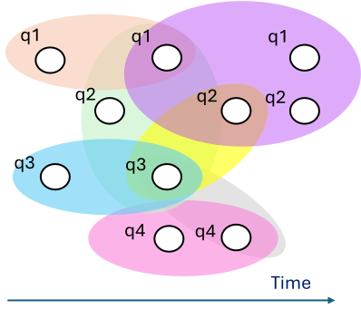
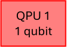
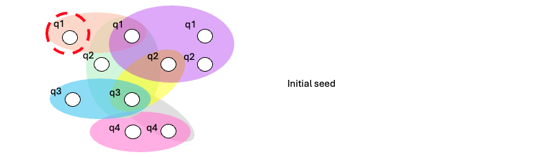
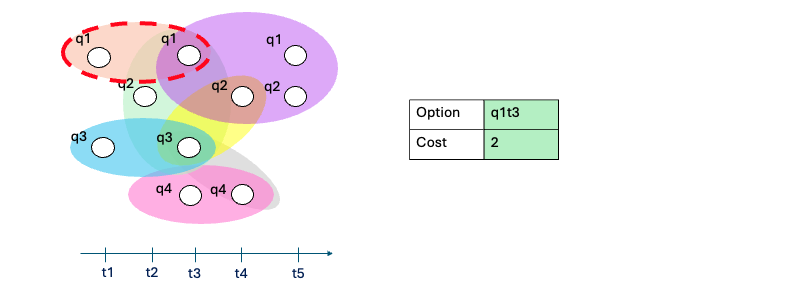
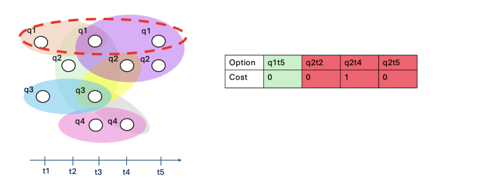
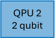
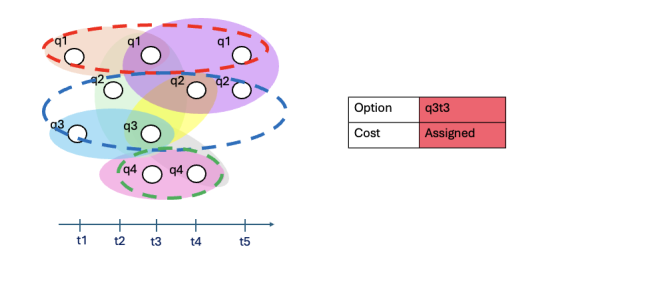
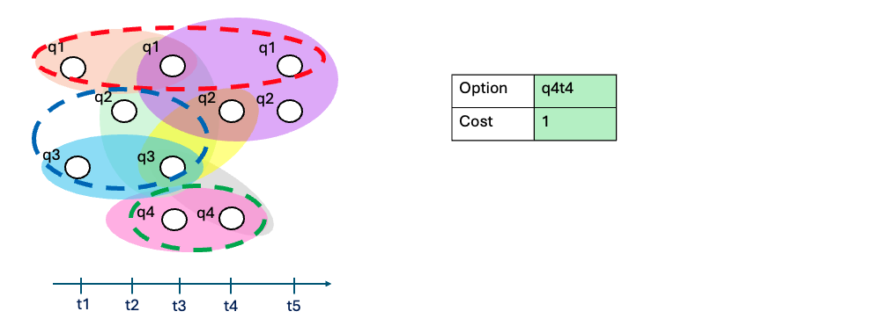
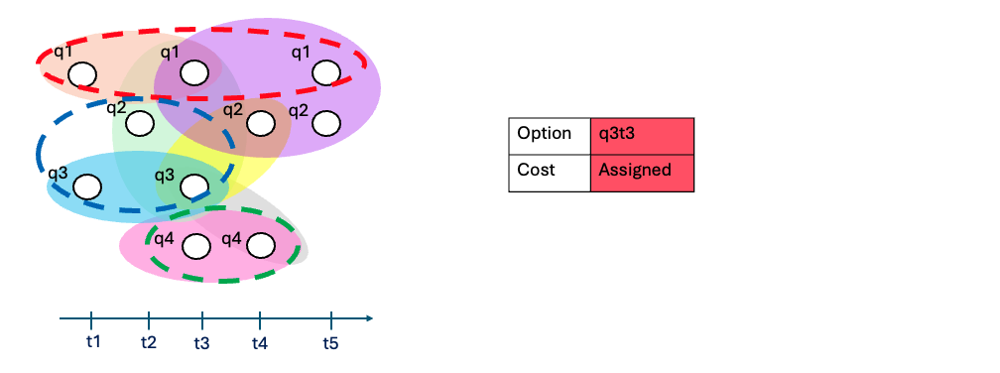

# HDH Partitioning Utilities

Here is an overview of the partitioning utilities available in the HDH library.

---

## Partitioning HDHs for Distribution

The `hdh/passes` directory contains scripts for partitioning and manipulating HDH graphs. The primary file for partitioning is `cut.py`, which offers two main approaches: a greedy, HDH-aware method and a METIS-based method operating on a qubit graph representation (telegate).

### Default cut algorithm

The main partitioning function is `compute_cut`, which implements the **Capacity-Aware Greedy HDH Partitioner** in `cut.py`. 


<!-- ### Core mechanics

* **Node-level assignment:** individual HDH nodes like `q7_t16` are assigned, not whole logical qubits. 
* **Capacity is in unique logical qubits:** each bin tracks the set of `q` indices present; adding a node only “costs capacity” if it introduces a new logical qubit into that bin. 
* **No automatic sibling co-location:** temporal siblings of the same qubit are *not* forced into the same bin (teledata-style cuts are therefore possible).
* **Temporal validity:** candidates are expanded through a time-respecting frontier (edges “activate” at the max time of their pins). -->

#### Default cut algorithm

The default capacity-aware HDH partitioning algorithm operates in three phases. 

##### Phase 1: Greedy bin filling via temporal expansion

The algorithm begins by selecting the earliest unassigned HDH node as a seed and opening a new bin associated with a target QPU. The bin is expanded forward in time: at each step, the algorithm identifies a frontier of unassigned nodes connected to the current bin via time-respecting HDH dependencies. From this frontier, it selects the node whose inclusion minimizes the incremental communication cost, subject to the bin's capacity constraint. Candidates that would exceed capacity are excluded.
Ties are broken in the following order: 
(1) nodes on the same qubit as the seed are preferred, 
(2) among remaining ties, earlier nodes are selected first. 
If an operation produces multiple successor nodes, each is evaluated independently.

##### Phase 2: Sequential bin construction

Once no further admissible expansions remain (either due to capacity saturation or an exhausted frontier) the current bin is closed and the next bin is opened for the next available QPU. This repeats until all QPUs have been assigned or no unassigned nodes remain.

##### Phase 3: Residual assignment

If unassigned nodes remain after all bins have been instantiated, the algorithm attempts to place them in 
a best-fit procedure (assigning the next remaining node minimum incremental cost).
A node is assigned to a bin only if doing so does not introduce a new qubit beyond the bin’s remaining capacity.
Nodes that cannot be placed in any bin without violating capacity constraints are left unassigned. 
This occurs when the remaining nodes cannot be placed without exceeding the available capacity of all devices.
of a given network prior to partitioning, avoiding infeasible instances.
This phase ensures completeness of the assignment under the imposed capacity constraints.

---

### Worked Example

The following walks through the greedy partitioner step by step on a small artificial computation, so you can see exactly how the three phases play out in practice.

> **Note on cost model:** This example uses a uniform cost of 1 for all hyperedge cuts, rather than the default weighted model (quantum = 10, classical = 1). This is just to keep the numbers easy to follow — the algorithm itself is identical regardless of the cost function supplied.

#### Inputs

The example uses a directed hypergraph representing the computational dependencies of a workload, distributed across a three-QPU network in a line topology. The QPUs have capacities of **1, 2, and 1 qubit** respectively. This is intentionally a tiny instance — the goal is clarity, not realism.

|  |  |
|:---:|:---:|
| Directed hypergraph of computational dependencies | Three-QPU line network with per-device capacities 1, 2, 1 |

---

#### Phase 1 — Filling QPU1 (capacity: 1 qubit)



**Seed:** The earliest unassigned node is selected as the seed: `q1t1`.



**Step 1:** The only node reachable from `q1t1` is `q1t3`. Adding it would not introduce a new qubit (it is still qubit 1), so capacity is respected. There are no other candidates, so `q1t3` is taken.



**Step 2:** Four nodes are now connected to the QPU1 bin: `q1t5`, `q2t3`, `q2t4`, and `q2t5`. Only `q1t5` is admissible — the others all belong to qubit 2, which would bring the bin over its 1-qubit capacity. Among candidates with equal incremental cost, nodes on the same qubit as the seed are preferred, so `q1t5` would be selected even if capacity were not a constraint. We take `q1t5`.



**Step 3:** The remaining frontier contains `q2t4` and `q2t5`. Neither can be assigned without introducing qubit 2 into a bin already at capacity. No admissible expansion remains — the QPU1 bin is closed.


---

#### Phase 2 — Filling QPU2 (capacity: 2 qubits)



**Seed:** The next earliest unassigned node is `q2t2`.


**Step 1:** Two nodes are reachable: `q1t3` (already assigned to QPU1) and `q3t3`. Since `q1t3` is unavailable, we take `q3t3`.


**Step 2:** Three candidates are now connected to the QPU2 bin: `q2t4`, `q3t1`, and `q4t4`. Adding `q4t4` would introduce a third qubit into a bin that can hold only two — it is excluded. Between `q2t4` and `q3t1`, adding `q3t1` incurs zero incremental communication cost (it is only connected to `q3t3`, which is already in this bin), so it is preferred. We take `q3t1`.


**Step 3:** The bin is now full (qubits 2 and 3). The only remaining viable candidate is `q2t4` — it belongs to qubit 2, which is already in the bin, so no new qubit is introduced. We take `q2t4`.


**Step 4:** Same reasoning — `q2t5` is the only viable candidate. We take it.


**Step 5:** The only node still connected to the QPU2 bin is `q3t3`, which is already assigned. No admissible expansion remains — the QPU2 bin is closed.



---

#### Phase 2 (continued) — Filling QPU3 (capacity: 1 qubit)


**Seed:** The next earliest unassigned node is `q4t3`.


**Step 1:** The only reachable node is `q4t5`, which belongs to qubit 4 — already in this bin. We take it.



**Step 2:** No further nodes are connected to the QPU3 bin. The bin is closed.



---

#### Phase 3 — Residual assignment

All nodes have been assigned by the end of Phase 2, so Phase 3 is skipped entirely.

The final partition assigns `{q1t1, q1t3, q1t5}` to QPU1, `{q2t2, q2t4, q2t5, q3t1, q3t3}` to QPU2, and `{q4t3, q4t5}` to QPU3 — each within the capacity of its device.

---

### METIS Telegate Partitioner

For an alternative partitioner, the library provides the `metis_telegate` function, which leverages the METIS algorithm (with a fallback to the Kernighan-Lin algorithm if METIS is not available) on a graph 
generated by interpreting workload qubits as nodes and operations as 
edges.

*Note: this method is not capable of representing operations implemented on more than 2 states, such as Toffoli gates & only interprets quantum correlations.*

#### Telegate Graph Construction

* **Graph transformation:** This method first converts the HDH into a "telegate" graph using the `telegate_hdh` function. In this representation:
    * **Nodes** are the qubits of the quantum circuit (labeled as `q{idx}`).
    * **Edges** represent quantum operations between qubits (i.e., their co-appearance in a quantum hyperedge).
    * **Edge weights** correspond to the multiplicity of interactions between two qubits.
* **Quantum operation filtering:** Only hyperedges marked as quantum operations (with `tau` attribute = "q") are considered when building the telegate graph.

#### Partitioning Process

* **METIS partitioning:** The telegate graph is partitioned using the `nxmetis` library, which provides Python bindings to the highly efficient METIS graph partitioning tool.
    * If METIS is unavailable, the algorithm automatically falls back to the Kernighan-Lin bisection algorithm from NetworkX.
    * METIS attempts to respect capacity constraints through the `tpwgts` (target partition weights) and `ubvec` (unbalance vector) parameters.
* **Overflow repair:** Since METIS does not guarantee perfectly balanced partitions, a greedy rebalancing algorithm (`_repair_overflow`) is used to adjust the partitions and ensure that no bin exceeds its qubit capacity.
    * The repair algorithm uses a heuristic gain function (`_best_move_for_node`) to choose which qubits to move between bins.
    * It prioritizes moving qubits that minimize the increase in cut edges.


#### Function Signature

```python
def metis_telegate(hdh: "HDH", partitions: int, capacities: int) -> Tuple[List[Set[str]], int, bool, str]
```

**Parameters:**

* `hdh`: The HDH graph to partition
* `partitions`: Number of partitions (k)
* `capacities`: Capacity per partition (in qubits)

**Returns:**

* A tuple of `(bins_qubits, cut_cost, respects_capacity, method)` where:
    * `bins_qubits` is a list of sets, each containing qubit IDs (as strings like `"q0"`, `"q1"`) in that partition
    * `cut_cost` is the number of edges crossing between partitions (unweighted)
    * `respects_capacity` is a boolean indicating whether all bins satisfy the capacity constraint
    * `method` is either `"metis"` or `"kl"` indicating which algorithm was used

### KaHyPar hypergraph partitioner 

`cut.py` also includes a KaHyPar-based partitioner, taken from the [KaHyPar library](https://kahypar.org).
To versions are included (qubit and node based):

**`kahypar_cutter`**

* Vertices are *logical qubits*.
* Each HDH hyperedge contributes a hyperedge over the qubits that appear in it.
* KaHyPar then runs its multilevel hypergraph partitioning pipeline (coarsening → initial partition → refinement), configured by an INI file (e.g., `km1_kKaHyPar_sea20.ini`).
* Capacity is expressed as a *balance constraint* via KaHyPar’s `epsilon` (derived from `cap` relative to the ideal target size `n/k`). 
* This means the partitioner primarily “knows” about **balancing qubit counts**; it does not model HDH-specific capacity nuances (for example, heterogeneous per-QPU capacities, or time-expanded node effects), and any “capacity” notion lives inside the balance constraint.

**`kahypar_cutter_nodebalanced`:**

* Vertices are *HDH nodes* (time-expanded).
* Balance is therefore in **node count**, not in unique logical qubits.
* As a result, it can produce partitions that look well-balanced to KaHyPar but **do not respect logical-qubit capacity** (this is kind-off not respected by the other version either, but this one is even egregious as it doesn't know if a node would require a new active qubit in use).
---

## Cut Cost Evaluation

The quality of a partition is determined by the number of cut hyperedges, that is, the number of hyperedges that span across multiple QPUs (bins). The library provides two functions to evaluate this cost given a partitioning:

### `_total_cost_hdh`

Calculates the total cost of a partition on an HDH graph. This function:

* Iterates through all hyperedges in the HDH
* Counts a hyperedge as "cut" if its pins (nodes) are distributed across 2 or more bins
* Returns the sum of weights of all cut hyperedges (quantum hyperedges count as 10 and classic hyperedges count as 1 - you can modify these values in the source code but if you would like this to be adjustable please feel free to open an issue)

### `_cut_edges_unweighted`

Counts the number of edges that cross between different bins in a standard graph (used for evaluating telegate graph partitions). This function:

* Takes a NetworkX graph and a partition assignment
* Counts edges where the two endpoints are in different bins
* Returns an unweighted count (each cut edge counts as 1)

**Use case:** This is specifically used by `metis_telegate` to evaluate the quality of qubit-graph partitions.

---

## Helper Functions and Internal Components

The `cut.py` file contains helper utilities for the partitioners (note that some older helpers/classes remain in the file as legacy code paths).

### Temporal incidence + frontier utilities (greedy partitioner)

* `_build_temporal_incidence`: builds `inc[node] -> [(hyperedge, edge_time)]` and `pins[hyperedge] -> {nodes}`, where `edge_time = max(pin_times)`; used to enforce temporal validity. 
* `_push_next_valid_neighbors`: expands a node into the min-heap frontier, pushing only temporally valid neighbour candidates. 
* `_select_best_from_frontier_with_rejected`: takes the earliest `beam_k` frontier items (skipping rejected), evaluates delta cost, and returns the best candidate. 
* `_compute_delta_cost_simple`: delta in (unweighted) cut-hyperedge count if a node is added to a specific bin. 
* `_extract_qubit_id`: parses `q{idx}_t{t}` to extract the logical qubit index for capacity accounting. 

### METIS utilities

* `telegate_hdh`: converts the HDH to a qubit interaction graph (“telegate graph”). 
* `_repair_overflow`, `_best_move_for_node`, `_over_under`: post-processing used to fix capacity violations after METIS/KL.
* `_cut_edges_unweighted`: unweighted cut-edge count for the telegate graph. 

---

## Notes on Evaluating Partitioners on Random Circuits

*We would like to warn users and partitioning strategy developers that we have found partitioners to behave very differently on real quantum workloads (such as circuits) when compared to randomly generated ones. As such, we recommend **not testing partitioners on randomly generated workloads** unless that is specifically your goal.*

**Key considerations:**

* **Circuit structure matters:** Real quantum algorithms often have characteristic patterns (e.g., layered structures, specific qubit interaction patterns) that random circuits lack.
* **Connectivity patterns:** Random circuits may not reflect the typical connectivity found in QAOA, VQE, quantum simulation, or other structured quantum algorithms.