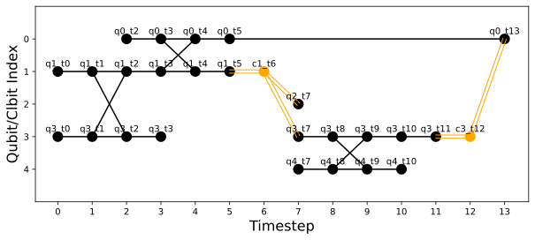

# Visualising HDHs
```plot_hdh``` renders an HDH as a time-vs-index diagram, showing how ```q```uantum and ```c```lassical states evolve across timesteps and how hyperedges connect them.

```python
plot_hdh(hdh: HDH, save_path: str | None = "hdh_plot.svg") -> None
```

The function returns nothing. By default it saves the plot to `hdh_plot.svg`
in the current directory; pass a different path (e.g. `save_path="hdh.png"`)
to save elsewhere, or `save_path=None` to instead show the plot in a Python
window without saving it.

It can be used on any HDH, after it is generated from model instructions:
```python
import hdh
from hdh.models.qca import QCA
from hdh.visualize import plot_hdh

# Topology of lattice over which QCA will evolve
topology = {
    "q0": ["q1", "q2"],
    "q1": ["q0"],
    "q2": ["q0"]
}

measurements = {"q1", "q2"}

qca = QCA(topology=topology, measurements=measurements, steps=3)
hdh = qca.build_hdh() # Generate HDH
fig = plot_hdh(hdh) # Visualize HDH
```
{ width=600 }

or directly from "manually" defining all nodes and hyperedges of a HDH:
```python
import hdh
from hdh.hdh import HDH
from hdh.visualize import plot_hdh

hdh = HDH()

# swap
hdh.add_node("q1", 0, "q")
hdh.add_node("q3", 0, "q")
hdh.add_node("q1", 1, "q")
hdh.add_node("q3", 1, "q")
hdh.add_node("q1", 2, "q")
hdh.add_node("q3", 2, "q")
hdh.add_node("q1", 3, "q")
hdh.add_node("q3", 3, "q")
hdh.add_hyperedge(["q1_t0", "q1_t1"], "q")
hdh.add_hyperedge(["q3_t0", "q3_t1"], "q")
hdh.add_hyperedge(["q1_t1", "q3_t1", "q1_t2", "q3_t2"], "q")
hdh.add_hyperedge(["q1_t2", "q1_t3"], "q")
hdh.add_hyperedge(["q3_t2", "q3_t3"], "q")

# # cnot
hdh.add_node("q0", 4, "q")
hdh.add_node("q0", 3, "q")
hdh.add_node("q0", 2, "q")
hdh.add_node("q1", 4, "q")
hdh.add_node("q0", 5, "q")
hdh.add_node("q1", 5, "q")
hdh.add_hyperedge(["q0_t2", "q0_t3"], "q")
hdh.add_hyperedge(["q1_t3", "q1_t4", "q0_t3", "q0_t4"], "q")
hdh.add_hyperedge(["q0_t4", "q0_t5"], "q")
hdh.add_hyperedge(["q1_t4", "q1_t5"], "q")

# meas
hdh.add_node("c1", 6, "c")   
hdh.add_node("q3", 7, "q")   
hdh.add_node("q2", 7, "q")
hdh.add_hyperedge(["c1_t6", "q1_t5"], "c")
hdh.add_hyperedge(["c1_t6", "q3_t7"], "c")
hdh.add_hyperedge(["c1_t6", "q2_t7"], "c")

# target cnot
hdh.add_node("q3", 8, "q")
hdh.add_node("q4", 8, "q")
hdh.add_node("q3", 9, "q")
hdh.add_node("q4", 9, "q")
hdh.add_node("q4", 7, "q")
hdh.add_node("q4", 10, "q")
hdh.add_node("q3", 10, "q")
hdh.add_hyperedge(["q3_t8", "q4_t8","q3_t9", "q4_t9"], "q")
hdh.add_hyperedge(["q3_t8", "q3_t7"], "q")
hdh.add_hyperedge(["q4_t8", "q4_t7"], "q")
hdh.add_hyperedge(["q4_t9", "q4_t10"], "q")
hdh.add_hyperedge(["q3_t9", "q3_t10"], "q")

# h gate
hdh.add_node("q3", 11, "q")
hdh.add_hyperedge(["q3_t10","q3_t11"], "q")

# meas
hdh.add_node("q0", 13, "q")
hdh.add_node("c3", 12, "c")
hdh.add_hyperedge(["c3_t12", "q3_t11"], "c")
hdh.add_hyperedge(["c3_t12", "q0_t13"], "c")
hdh.add_hyperedge(["q0_t5", "q0_t13"], "q")

fig = plot_hdh(hdh,save_path="test2.svg") # Visualize HDH
```

{ width=600 }

A few things to note about the HDH visualizations:

* **Index ordering**: y-positions are “flipped” so that the largest index appears at the bottom of the axis, while tick labels still increase upward. This matches typical circuit diagrams where q0 is drawn at the top. This is consistent with popular quantum packages, and allows for users to "read" from top to bottom.

* **Participation filter**: nodes not present in any edge are omitted from the plot to reduce clutter.

* **Style inference**: if the hyperedge type is not defined for an edge, it is inferred from its output nodes (if one of the nodes is classical it assumes classical, otherwise it defaults to quantum).

* **Same-timestep edges**: are not drawn (to avoid the misconception that cuts can occur "instantaneously" -> they require communication primitives and thus operations spanning different partitions must have experienced a cut previous to their execution).

- **Lazy qubit appearance**: qubits appear in the diagram only when first used in an operation.  
  Their initialization motifs (e.g. in the Circuit model) are delayed until *one timestep before* the first gate on that qubit.  
  This reduces clutter from unused wires.  
  Example: in the HDH above, qubit 4 only begins appearing from timestep 7.