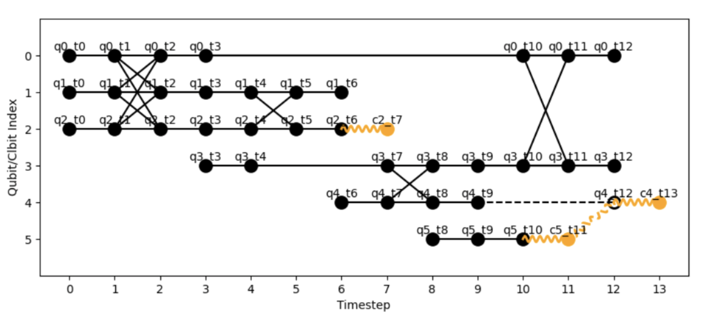

# Summary

Quantum computing aims to solve computational problems that are classically hard. 
To achieve this in utility settings, quantum computers will require 
thousands if not millions of qubits. Current devices hold hundreds at most. 
It is believed that the path towards this scalability will come from distribution.
Distributed quantum computing (DQC) partitions large quantum computations across multiple smaller devices, but existing approaches lack a unified framework for comparing and developing partitioning strategies across different computational models.

# Statement of need

`HDH` is a Python package designed for researchers to test and develop partitioning strategies 
for quantum computation. 
HDHs (Hybrid Dependency Hypergraphs) are an intermediate representation (IR) which abstracts any quantum computation, originating from any model, including circuits, measurement-based quantum computing (MBQC), quantum cellular automata, and quantum walks, to a directed hypergraph that expresses all possible partitions available in the computation.
They were originally proposed in [@Gragera:2025] as a unifying approach to quantum distribution, extending the hypergraph abstraction method for partitioning across devices originally proposed in [@Andres:2019].
Since then, various partitioning strategies have been proposed [@Clark:2023; @Escofet:2023; @Sundaram:2023], but many are tested on inconsistent hypergraph abstractions, making cross-partitioner testing and improvement impossible.
Having a consistent and model-agnostic IR enables fair and consistent cross-comparison of partitioning strategies. 
Furthermore, HDHs extend this capability beyond the circuit model, addressing a current blind spot in DQC research. 

`HDH` is designed to be used by both distributed quantum architecture researchers 
and compiler developers. No other libraries are dedicated to the specific advancement 
of partitioning heuristics based on directed hypergraph abstraction.

While quantum compilation frameworks like 
Qiskit [@Qiskit], Cirq [@Cirq], and PennyLane [@PennyLane] provide circuit 
optimization and device mapping, they do not offer model-agnostic abstractions 
for distributed quantum computing. Hypergraph-based approaches exist in specific 
contexts [@Andres:2019; @Clark:2023; @Escofet:2023], but lack a unified implementation that 
supports multiple computational models and provides a common platform for 
partitioning algorithm development.

## Model conversions

Any quantum computing model comprises a series of commands which establish qubit 
rotations, measurements and entanglements. For instance, quantum circuits are 
comprised of a sequence of quantum gates applied to qubits. Single-qubit gates 
perform rotations on the Bloch sphere, while multi-qubit gates (such as CNOT) 
create entanglement dependencies between qubits.

These entanglement operations can be made non-local and thus partitioned through 
a quantum network via quantum communication primitives [@Wu:2022]. Alternatively, 
qubit states can be individually forwarded through teleportation protocols 
[@Moghadam:2017]. HDHs aim to showcase all these possible partitionings, enabling 
heuristic partitioners to exploit recurring patterns from quantum algorithm 
implementations and map workloads to quantum or hybrid networks whilst minimizing 
communication or other costs.

Mapping quantum workloads to HDHs involves applying specific correspondences 
between model elements and hypergraph motifs. The library provides model-specific 
classes such as the `Circuit` class that enables straightforward conversion:

# The HDH database
To support reproducible evaluation and training of partitioning strategies, this library's git repository also includes a database of pre-generated HDHs as well as the partitions offered by some of the state of the art partitioners.
This resource aims to facilitate benchmarking across diverse workloads and enable the development of learning-based distribution agents.

# Acknowledgements

We acknowledge contributions from [Joseph Tedds](https://github.com/josephtedds), [Manuel Alejandro](https://github.com/manalejandro), and [Alessandro Cosentino](https://github.com/cosenal).

We thank Unitary Fund for supporting this project through their quantum microgrant program.

The work of the author is supported by the EPSRC UK Quantum Technologies Programme under grant EP/T001062/1 and VeriQloud.
