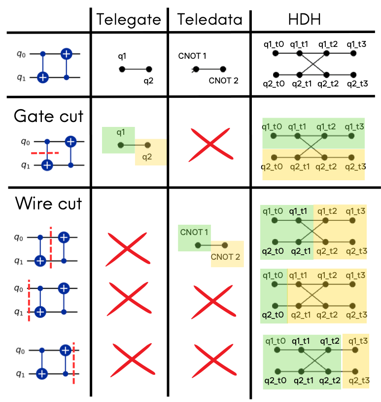
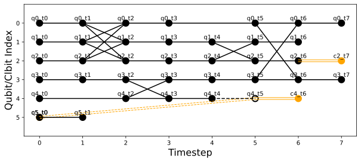

# Summary

Quantum computing aims to solve computational problems that are classically hard. 
To achieve this in utility settings, quantum computers will require 
thousands if not millions of qubits. Current devices hold hundreds of qubits at most. 
It is believed that the path towards these scales will come from distribution, meaning the collaboration of various devices to complete tasks larger than their individual capacities.
The main goal behind Distributed Quantum Computing (DQC) is to allocate sub-partitions of large quantum computations across multiple devices smaller than the computation itself. Existing approaches abstract computations to hypergraphs which are then partitioned, but they lack a unified framework for comparing and developing partitioning strategies within and across computational models.


# Statement of need

`HDH` is a Python package designed for researchers to test and develop partitioning strategies 
for quantum workloads. 

HDHs (Hybrid Dependency Hypergraphs) are an abstraction which transforms quantum computation, originating from any quantum computational model (including circuits, measurement-based quantum computing, quantum cellular automata, and quantum walks), to a directed hypergraph that expresses all possible partitions available within the computation.
They were originally proposed in [@Gragera:2025] as a unifying approach to quantum distribution, extending the hypergraph abstraction method for partitioning across devices originally proposed in [@Andres:2019].
Since then, various partitioning strategies have been proposed [@Clark:2023; @Escofet:2023; @Sundaram:2023], but many are tested on inconsistent hypergraph abstractions, hindering cross-partitioner comparison and improvement.

Having an easy to implement, open-source, and model-agnostic abstraction will enable the fair and consistent cross-comparison of partitioning strategies in future work. 
Furthermore, HDHs extend this capability beyond the circuit model, addressing a current blind spot in DQC research. 

`HDH` is designed to be used by both distributed quantum architecture researchers 
and compiler developers. No other libraries are dedicated to the specific advancement 
of partitioning heuristics based on directed hypergraph abstraction.
While quantum compilation frameworks like 
Qiskit [@Qiskit], Cirq [@Cirq], and PennyLane [@PennyLane] provide circuit 
optimization and device mapping, they do not offer model-agnostic abstractions 
for distributed quantum computing.
The `HDH` library is compatible with these SDKs, making it a seamless addition to state of the art quantum software stacks.


## Model conversions

Any quantum computing model comprises a series of commands which establish qubit state 
rotations, measurements and entanglements. For instance, quantum circuits are 
comprised of a sequence of quantum gates applied to qubits. Single-qubit gates 
perform rotations on the Bloch sphere, while multi-qubit gates (such as CNOT) 
create entanglement dependencies between qubits.

HDHs use the following notation to describe quantum workload dependencies, 
including predicted elements that represent potential future state 
transformations based on classical measurement outcomes:

{ width=35% }

Mapping a quantum workload such as a circuit to an HDH involves applying specific correspondences between model elements and hypergraph motifs. This library provides model-specific classes such as the `Circuit` class that enable straightforward conversions to HDHs using mapping tables:

{ width=35% }

In the context of DQC, entangling operations in a model can be made non-local (namely non-local gates) and thus partitioned through 
a quantum network via quantum communication primitives [@Wu:2022]. Alternatively, 
qubit states can be individually forwarded through teleportation protocols 
[@Moghadam:2017]. HDHs aim to showcase all possible partitionings, thus enabling heuristic partitioners to exploit recurring patterns when mapping workloads to quantum or hybrid networks, thereby minimizing communication and other costs.

The table below shows how HDHs supersede previous abstractions in their 
expressivity of these partitioning options. Unlike prior approaches that 
represent only non-local gates or only teleportation, HDHs capture both 
strategies simultaneously, enabling partitioners to optimize across all 
available distribution methods:

{ width=50% }

The library provides model-specific classes such as the `Circuit` class to enable workload to HDH translation:
```python
import hdh
from hdh.models.circuit import Circuit
from hdh.visualize import plot_hdh

circuit = Circuit()

# Set of instructions
circuit.add_instruction("ccx", [0, 1, 2])
circuit.add_instruction("h", [3])
circuit.add_instruction("h", [5])
circuit.add_instruction("cx", [3, 4])
circuit.add_instruction("cx", [2, 1])

circuit.add_conditional_gate(5, 4, "z") 

circuit.add_instruction("cx", [0, 3])
circuit.add_instruction("measure", [2])
circuit.add_instruction("measure", [4])

hdh = circuit.build_hdh()  # Generate HDH
fig = plot_hdh(hdh)  # Visualize HDH
```

The resulting HDH is shown below as a graph representation of a hypergraph, since visualizing large, multi-colored hypergraphs directly becomes impractical at scale. Gates have hyperedges corresponding to the qubit state transformations they generate, as well as preceding and following hyperedges that capture pre- and post-teleportation of the involved states. HDHs differ from previous abstractions in two key ways: 

(1) nodes represent possible state transformations rather than individual qubits or operations, and 

(2) classical data flows are explicitly included (shown in orange):

{ width=80% }

# Acknowledgements

We acknowledge contributions from [Joseph Tedds](https://github.com/josephtedds), [Manuel Alejandro](https://github.com/manalejandro), and [Alessandro Cosentino](https://github.com/cosenal).

We thank Unitary Fund for supporting this project through their quantum microgrant program.

The work of the author is supported by the EPSRC UK Quantum Technologies Programme under grant EP/T001062/1 and VeriQloud.

# References