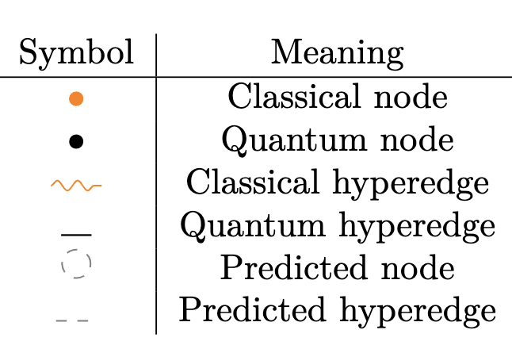
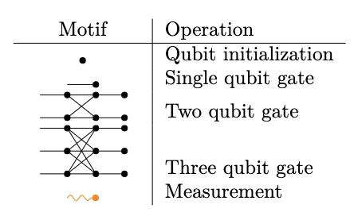
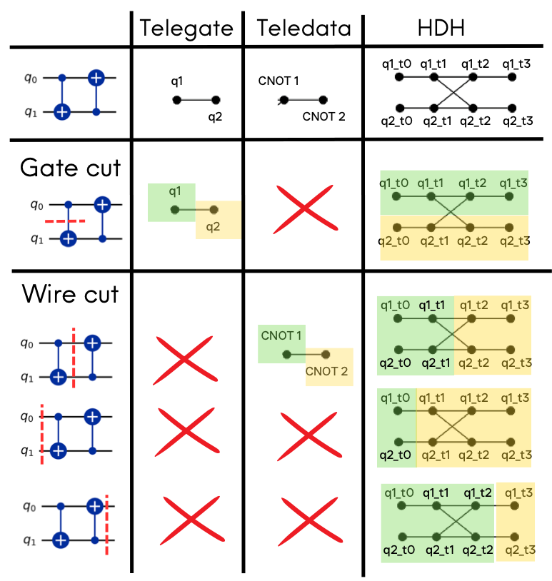
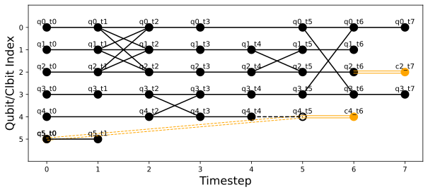

# Summary

Today's quantum computers are limited by how many qubits a single device can hold. Distributed quantum computing (DQC) works around this by linking multiple smaller devices together so they can jointly run computations too large for any one of them alone, which first requires deciding how to split, or partition, a computation across those devices.

`HDH` (Hybrid Dependency Hypergraphs) is a Python library that gives researchers a common representation to develop and compare partitioning strategies against. It converts a quantum computation — expressed as a circuit, a measurement-based pattern, a quantum walk, or a quantum cellular automaton — into a hypergraph that captures every way the computation could be split across devices, including hard constraints such as per-device qubit limits that prior abstractions treat as soft penalties rather than requirements. Researchers can run their own partitioning heuristics directly on this representation, or use `HDH`'s built-in capacity-aware baseline, and compare results on a consistent, model-agnostic footing. `HDH` also imports circuits from popular quantum SDKs (Qiskit, Cirq, PennyLane, Amazon Braket) and exports back to Qiskit and PennyLane, so partitioned results can be turned back into runnable circuits.

# State of the field

Quantum computing aims to solve computational problems that are classically hard. 
To achieve this in utility settings, quantum computers will require 
thousands if not millions of qubits. Current devices hold hundreds of qubits at most. 
It is believed that the path towards these scales will come from distribution, meaning the collaboration of various devices to complete tasks larger than their individual capacities.
The main goal behind Distributed Quantum Computing (DQC) is to allocate sub-partitions of large quantum computations across multiple devices smaller than the computation itself. 
Existing approaches abstract computations to hypergraphs which are then partitioned, using balanced hypergraph partitioning solvers such as KaHyPar [@schlag2023high].

This framing has two fundamental limitations:

1. It reduces distribution to a balanced partitioning problem that ignores a hard physical constraint: individual QPUs have fixed qubit capacities, and a valid distribution must respect these limits strictly rather than treating them as soft penalties.
2. Existing hypergraph abstractions are model-specific and encode only a subset of possible partition cuts, meaning partitioning strategies are routinely evaluated on inconsistent abstractions, making cross-comparison unreliable and hindering the systematic development of improved heuristics.

While libraries for distributed quantum computing exist 
(DISQCO [@burt2026multilevel], Qdislib [@tejedor2025orchestrating], 
Optyx [@kupper2025optyx], DC-MBQC [@xue2026dc]), these implement end-to-end 
distribution pipelines rather than exposing the underlying abstraction as a 
research tool. No existing library provides a model-agnostic hypergraph abstraction 
designed specifically to enable the development and fair comparison of partitioning 
heuristics (the role `HDH` is built to fill).

Quantum compilation frameworks like Qiskit [@Qiskit], Cirq [@Cirq], and 
PennyLane [@PennyLane] provide circuit optimization and device mapping, but they do 
not offer model-agnostic abstractions for distributed quantum computing. 
The `HDH` library is compatible with these SDKs, making it a seamless addition 
to state-of-the-art quantum software stacks rather than a replacement for them.

The `HDH` library aims to tackle both limitations above, providing a unified and accessible starting point for the research of DQC partitioners.

# Statement of need

`HDH` is a Python package designed for researchers to test and develop partitioning strategies 
for quantum workloads. 

HDHs (Hybrid Dependency Hypergraphs) are an abstraction which transforms quantum computation, originating from any quantum computational model (including circuits, measurement-based quantum computing, quantum cellular automata, and quantum walks), to a directed hypergraph that expresses all possible partitions available within the computation.
They were originally proposed in [@Gragera:2025] as a unifying approach to quantum distribution, extending the hypergraph abstraction method for partitioning across devices originally proposed in [@Andres:2019].
Various partitioning strategies have 
since been proposed building on that earlier abstraction [@Clark:2023; @Escofet:2023; @Sundaram:2023], but many are tested on inconsistent hypergraph abstractions, hindering cross-partitioner comparison and improvement.

Having an easy to implement, open-source, and model-agnostic abstraction will enable the fair and consistent cross-comparison of partitioning strategies in future work. 
Furthermore, HDHs extend this capability beyond the circuit model, addressing a current blind spot in DQC research. 

`HDH` is designed to be used by both distributed quantum architecture researchers 
and compiler developers building on existing frameworks who require a model-agnostic distribution layer.

# Software design

The central design decision in `HDH` was to separate the abstraction layer from 
the partitioning layer. Rather than building a monolithic tool that both constructs 
hypergraphs and partitions them, `HDH` exposes the HDH as a first-class data 
structure that any downstream partitioner can consume. This makes the library 
useful both as a standalone research tool and as a substrate for third-party heuristics.

A hypergraph-based representation was chosen over simpler graph 
alternatives, as quantum computing models frequently involve operations with more 
than two inputs or outputs (a Toffoli gate, for instance, acts on three qubits 
simultaneously), requiring multi-way correlations.

Two further design choices trade added complexity for partitioning flexibility. 
First, HDHs represent each qubit's state at every timestep as a separate node 
rather than a single node per logical qubit, and partitioning operates over 
these timestepped nodes rather than whole qubits. This allows a single qubit's 
history to be split across devices at whichever point in the computation makes 
the split cheapest, with its state teleported between them at that boundary, 
rather than committing the qubit to one device for the circuit's full duration. 
Second, a multi-qubit gate is represented not as one hyperedge but three: one 
linking each qubit's pre-gate state to an intermediate state, one spanning all 
involved qubits at that intermediate point, and one linking each qubit's 
post-gate state onward. This staging is what allows a partitioner to cut 
through a multi-qubit gate at either boundary — modelling either a non-local 
gate executed over the network or a teleportation of one qubit's state 
immediately before or after the gate — instead of being limited to the 
coarser choice of which side of a single gate-edge to place a device boundary 
on. The trade-off is a wider hypergraph in exchange for exposing substantially 
more of the partitioning search space than the single-edge-per-gate 
abstractions used by prior approaches.

The library includes a capacity-aware greedy heuristic as a built-in baseline. 
Existing DQC research typically benchmarks against KaHyPar [@schlag2023high], a 
general-purpose hypergraph partitioner not designed for quantum hardware constraints. 
While simpler than KaHyPar, the included heuristic treats per-device qubit 
capacity as a hard constraint, and returns a feasible assignment whenever one 
exists rather than trading feasibility off against balance. That makes it a more 
appropriate DQC baseline and a concrete starting point for researchers developing 
improved strategies.

Finally, `HDH` is implemented in Python to minimise the barrier to adoption. 
The quantum software community has converged on Python as its primary language, 
and compatibility with Qiskit, Cirq, and PennyLane was prioritised from the 
outset to ensure `HDH` integrates naturally into existing workflows.

# Model conversions

Any quantum computing model comprises a series of commands which establish qubit state 
rotations, measurements and entanglements. For instance, quantum circuits are 
comprised of a sequence of quantum gates applied to qubits. Single-qubit gates 
perform rotations on the Bloch sphere, while multi-qubit gates (such as CNOT) 
create entanglement dependencies between qubits.

HDHs use the following notation to describe quantum workload dependencies, 
including predicted elements that represent potential future state 
transformations based on classical measurement outcomes:

{ width=35% }

Mapping a quantum workload such as a circuit to an HDH involves applying specific correspondences between model elements and hypergraph motifs. This library provides model-specific classes such as the `Circuit` class that enable straightforward conversions to HDHs using mapping tables:

{ width=35% }

In the context of DQC, entangling operations in a model can be made non-local (namely non-local gates) and thus partitioned through 
a quantum network via quantum communication primitives [@Wu:2022]. Alternatively, 
qubit states can be individually forwarded through teleportation protocols 
[@Moghadam:2017]. Because HDHs represent both cut types within a single structure, a partitioner is free to combine them within one workload — e.g. keeping a qubit local to a device via non-local gates during one phase of a computation, then teleporting it elsewhere for a later phase — rather than being restricted to whichever single strategy the chosen abstraction happens to support.

The table below shows how HDHs supersede previous abstractions in their 
expressivity of these partitioning options. Unlike prior approaches that 
represent only non-local gates or only teleportation, HDHs capture both 
strategies simultaneously, enabling partitioners to optimize across all 
available distribution methods:

{ width=50% }

Usage examples for these conversions are available in the [documentation](https://grageragarces.github.io/HDH/). As an example, the figure below shows the HDH produced from a six-qubit circuit combining a three-qubit Toffoli gate, single-qubit gates, entangling two-qubit gates, a classically-conditioned gate, and mid-circuit measurements, shown as a graph representation of a hypergraph since visualizing large, multi-colored hypergraphs directly becomes impractical at scale. Gates have hyperedges corresponding to the qubit state transformations they generate, as well as preceding and following hyperedges that capture pre- and post-teleportation of the involved states. HDHs differ from previous abstractions in two key ways: 

(1) nodes represent possible state transformations rather than individual qubits or operations, and 

(2) classical data flows are explicitly included (shown in orange):

{ width=80% }

# Research impact statement

`HDH`'s capacity-aware partitioner reaches proven-optimal cut cost on 83% of
instances and averages $1.03\times$ optimal, measured against branch-and-bound
enumeration over MQT Bench circuits [@MQTBench] at the tightest feasible
capacity (three devices, network overhead 1). It also returns a feasible
assignment whenever one exists, which the balance-based partitioners used as
DQC baselines do not guarantee.

Carrying teledata and telegate cuts in one structure costs a partitioner
nothing and sometimes saves it a great deal. On standard MQT Bench circuits the
combined formulation ties the qubit-level formulation used by prior hypergraph
approaches. Where a qubit's interaction pattern shifts partway through a
computation, interacting with one group of qubits and later another, it costs
2--3$\times$ less (cut cost 1 against 3, then 3 against 6, as the number of
shifts grows). In every instance tested the combined formulation matched the
better of the two single-mode formulations without being told which applied.

What has no counterpart elsewhere is that the same partitioner runs unmodified
over circuits, MBQC patterns, quantum walks, and quantum cellular automata,
exercised across all four by the test suite. Comparing distribution overhead
between computational models is not a question a circuit-only library can pose;
here it is a matter of swapping the workload builder. A first such study
appears in a companion manuscript currently under review.

Every figure above regenerates from `benchmarks/`.

Early community engagement has been encouraging. The project was presented as a poster at SIGCOMM 2025 [@Gragera:2025] (a major networking venue), has received funding through the Unitary Fund microgrant program (dedicated to supporting open source quantum software to benefit humanity) and has already seen external contributors (acknowledged below).
Further, we are in discussion with companies in the Distributed Quantum Computing space regarding the library's integration within their stack.

The open-source release and documentation are intended to lower the barrier to reproducible research in DQC partitioning.

# Acknowledgements

We acknowledge contributions from [Joseph Tedds](https://github.com/josephtedds), [Manuel Alejandro](https://github.com/manalejandro), and [Alessandro Cosentino](https://github.com/cosenal).

We thank Unitary Fund for supporting this project through their quantum microgrant program.

The work of the author is supported by the EPSRC UK Quantum Technologies Programme under grant EP/T001062/1 and VeriQloud.

# AI usage disclosure
Claude was used during both library development and paper writing. 

In the library, Claude generated initial draft code implementations that were subsequently rewritten by the author. 
It also assisted in producing unit tests, which were validated against expected behaviour across both passing and failing scenarios. These were not always fully re-written but they were revised and thoroughly tested.
Additionally, AI was used to generate inline code comments throughout the library, with the aim of improving readability for contributors and users who may check the source code.

In the paper, Claude was used to assist with wording and polish. 

All AI-generated content (both code and text) was reviewed or modified (as per the above descriptions) 
by the author before inclusion in the present version.

# References